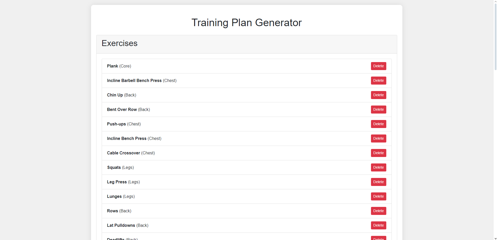
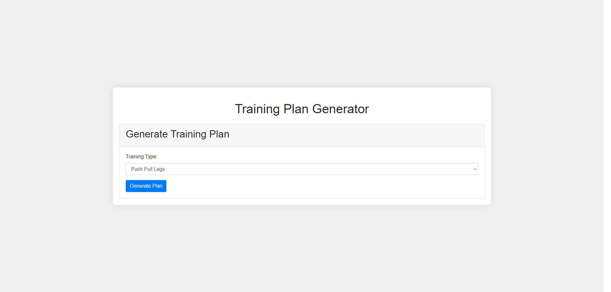

### About the project

Training Plan Generator is a web application that allows users to create and manage workout plans and exercise catalogs. Built using Flask, SQLAlchemy, and Jinja, it features a clean and intuitive interface. The application enables exercise management by allowing users to add, view, and delete exercises, with each exercise associated with a specific muscle group. Additionally, it provides the functionality to automatically generate workout plans based on different training types, such as Push Pull Legs, Split, and Full Body Workout. The home page offers options to add exercises, generate a training plan, or view existing exercises. Users can navigate to the add exercise page to input new exercises, specifying the name and muscle group. On the exercises page, a list of all exercises is displayed, with the option to delete any exercise directly. For generating training plans, users can select a training type on the home page and receive a customized workout plan. The application utilizes HTML and CSS for structuring and styling web pages, ensuring an aesthetically pleasing and user-friendly experience.

### Setup

1.Clone the repository:
```
git clone git clone https://github.com/yourusername/training-plan-generator.git
```
2.Navigate to the project directory:
```
cd training-plan-generator
```
3.Install dependencies:
```
pip install -r requirements.txt
```
4.Initialize the database:
```
from app import db
db.create_all()
```
5.Run the application:
```
flask run
```

### Screenshots








